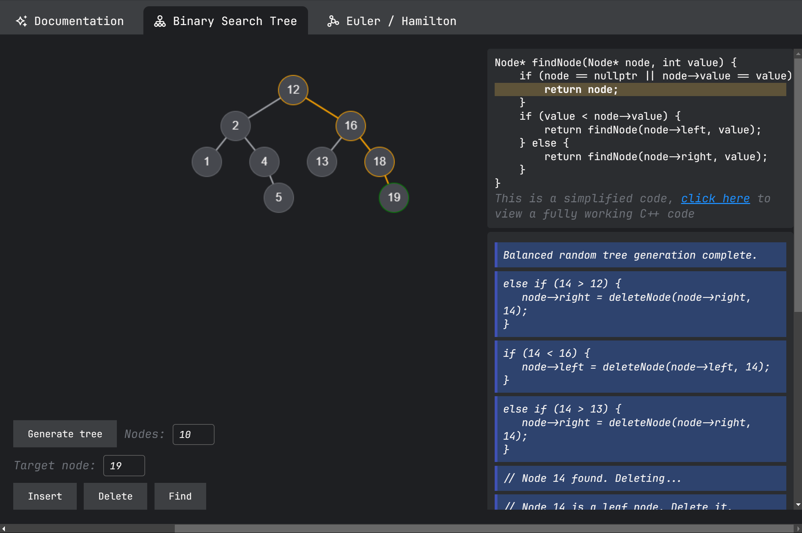
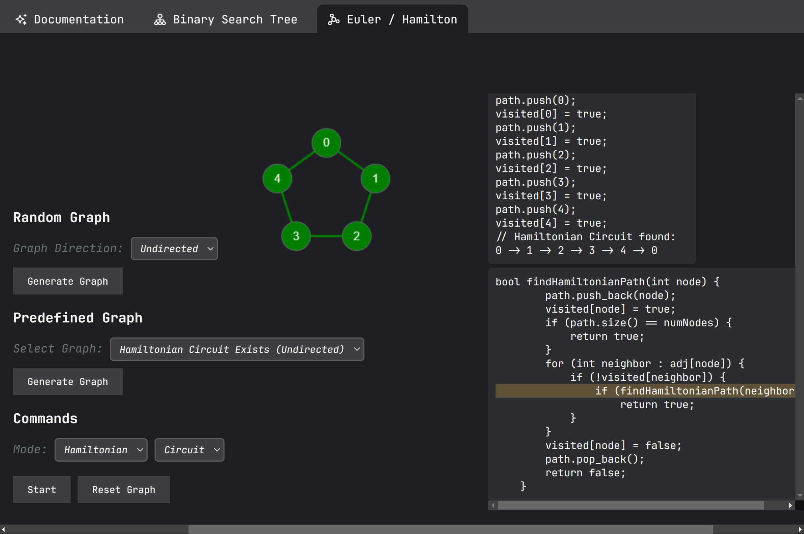

# Interactive Tree and Graph Algorithm Visualizer

This is a web-based tool that provides a visual representation of tree and graph data structures and offers an interactive environment to demonstrate various algorithms related to them.

## Screenshots

Below are examples of the tool in action:

### 1. **Binary Search Tree (BST) Visualization**
This section demonstrates the functionality of generating and interacting with a Binary Search Tree (BST). Users can insert, delete, and find nodes while observing real-time changes.

---

### 2. **Graph Visualization**
This section showcases graph structures, including random graph generation and predefined examples like Hamilton circuits. Algorithms can be visualized step by step.

## Features

### 1. **Binary Search Tree (BST) Visualization**
-   **Generate Tree**: Automatically create a balanced BST with customizable node counts.
-   **Insert, Delete, Find Operations**: Interactively perform operations on the BST and visualize their effects.
-   **Live Demo**: Watch how the tree dynamically updates during operations.

### 2. **Graph Visualization**
-   **Random Graph Generation**: Generate undirected graphs with customizable parameters.
-   **Predefined Graphs**: Explore specific scenarios, such as Eulerian circuits.
-   **Algorithms**:
    -   Visualize Eulerian paths and circuits.
    -   Future expansion for Hamiltonian paths or other graph-related algorithms.

### 3. **Interactive Interface**
-   Intuitive controls for generating, modifying, and interacting with tree and graph structures.
-   Real-time visual feedback to better understand algorithmic processes.

## Usage

1.  Clone the repository:
    `https://github.com/tuank-ph/GraphVisualizer.git` 
    
2.  Open `index.html` in your browser to launch the visualization tool.

## Dependencies

-   **Languages**: HTML, CSS, JavaScript
-   **Frameworks/Libraries**: This Website uses pure JS with Canvas .

## Future Plans

-   Add more algorithms (Dijkstra's, Prim's, Kruskal's, etc.)
-   Enhance graph customization options (directed/weighted graphs).
-   Include detailed explanations of algorithms alongside visualizations.

## Contribution

Contributions are welcome! Please submit pull requests or file issues for bug fixes, feature requests, or enhancements.

## License

This project is licensed under the MIT License. See the `LICENSE` file for details.